<h1 align="center">Rudra Kushwah</h1>

  

  <a href="https://linkedin.com/in/rudra-kushwah">LinkedIn</a>

  

---

## Now

Building AI systems that run in production, not notebooks.

- **Fine-tuning** - adapting open models to real workloads with LoRA and other parameter-efficient methods, then evaluating whether the result improved
- **Inference & serving** - routing between models, context handling, compression, quantization, and the cost/latency tradeoffs that decide what ships
- **Evaluation** - benchmark harnesses and regression suites, because "it feels better" is not a result
- **Knowledge graphs** - modelling entities and relationships, record linkage and entity resolution, querying graphs to answer causal questions
- **Agents & tooling** - tool-calling agents, MCP servers, and CLIs that developers actually keep installed
- **Data & telemetry pipelines** - collection, transformation, and the analytics layer on top
- **Infrastructure** - Docker, Linux, cloud deployment, and keeping all of the above running
- **Shipping** - real users, real constraints, real failure modes

## Before that

- **Computer Vision** - object detection and segmentation
- **Deep Learning** - CNNs and transformers, training and evaluating networks end to end
- **Classical ML** - regression, classification, clustering, feature engineering

## Toolkit

**ML/DL** `PyTorch` `Transformers` `Hugging Face` `scikit-learn` `OpenCV` `NumPy` `pandas`

**Systems** `Python` `Go` `TypeScript` `FastAPI` `Docker` `Linux` `Git` `React`
