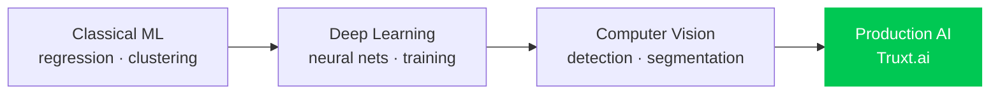

<h1 align="center">Rudra Kushwah</h1>

  

  <a href="https://linkedin.com/in/rudra-kushwah">LinkedIn</a>

---

## How I got here

---

## Now — @ Truxt.ai

Building AI systems that run in production, not notebooks.

- LLM infrastructure — routing, context handling, cost
- Telemetry pipelines and the analytics built on top of them
- Shipping to real users, with the constraints that come with that

## Before that

- **Computer Vision** — object detection and segmentation
- **Deep Learning** — training and evaluating neural networks
- **Classical ML** — [Real-Estate-ML](https://github.com/Crazyop757/Real-Estate-ML), price prediction with scikit-learn

## Projects

| Project | Stack |
|---|---|
| [Real-Estate-ML](https://github.com/Crazyop757/Real-Estate-ML) | Python · scikit-learn |
| [idea-forge-burst](https://github.com/Crazyop757/idea-forge-burst) | TypeScript |
| [Ayurveda_website](https://github.com/Crazyop757/Ayurveda_website) | CSS |
| [gaming_chatroom](https://github.com/Crazyop757/gaming_chatroom) | Hackathon project |

## Toolkit

`Python` `PyTorch` `OpenCV` `scikit-learn` `pandas` `TypeScript` `React` `Docker` `Git`
